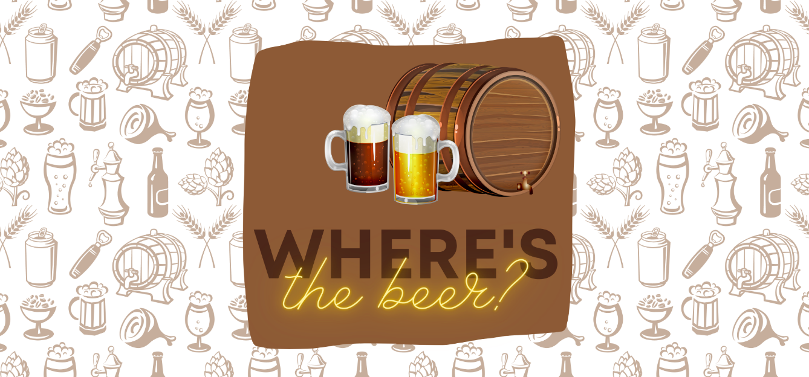

<div id="top"></div>

[![Issues][issues-shield]][issues-url]
[![MIT License][license-shield]][license-url]
[![LinkedIn][linkedin-shield]][linkedin-url]


<br />
<div align="center">
  <a href="https://github.com/heflerdev/Invest-Platform">
    
  </a>

  <h3 align="center">Beer App Frontend Challenge</h3>

  <p align="center">
     A small webapp made in React that fetch mock data and displays it to the user.
    <br />
    No live version yet
    <br />
    <br />
    <a href="https://github.com/HeflerDev/beer-app/issues">Report Bug</a>
    ·
    <a href="https://github.com/HeflerDev/beer-app/issues">Request Feature</a>
  </p>
</div>

<details>
  <summary>Table of Contents</summary>
  <ol>
    <li>
      <a href="#about-the-project">About The Project</a>
      <ul>
        <li><a href="#built-with">Built With</a></li>
      </ul>
    </li>
    <li>
      <a href="#getting-started">Getting Started</a>
      <ul>
        <li><a href="#prerequisites">Prerequisites</a></li>
        <li><a href="#installation">Installation</a></li>
      </ul>
    </li>
    <li><a href="#usage">Usage</a></li>
    <li><a href="#roadmap">Roadmap</a></li>
    <li><a href="#contributing">Contributing</a></li>
    <li><a href="#license">License</a></li>
    <li><a href="#contact">Contact</a></li>
    <li><a href="#acknowledgments">Acknowledgments</a></li>
  </ol>
</details>

## About The Project



This project is a test i made to apply to "INB" as junior dev. It consists in a mock beer database and the fact that I have to manipulate the data to show to the user.

<p align="right">(<a href="#top">back to top</a>)</p>

### Built With

* HTML
* SASS/CSS
* Bootstrap
* JavaScript
* React
* Redux
* [Webpack](https://webpack.js.org/)
* Eslint

<p align="right">(<a href="#top">back to top</a>)</p>

## Getting Started

The installing process is fairly simple, since doesn't need any API key or aditional configuration (other than have NPM).

### Prerequisites

* npm
  ```sh
  npm install npm@latest -g
  ```
  
[Node.js](https://nodejs.org/en/download/)

### Installation

1. Clone the repo
   ```sh
   git clone git@github.com:HeflerDev/beer-app.git
   ```
2. Install NPM packages
   ```sh
   npm install
   ```
3. Execute `npm run serve` in one terminal, and in another `npm start`. Respectivelly those commands will open the server in port 3000 and the development server in port 8080 (localhost:3000 | localhost:8080).

<p align="right">(<a href="#top">back to top</a>)</p>

## Usage

The project uses the Webpack bundler to produce a build, so is recommended to **ONLY** code in the *src/* folder.

To start the Dev server run `npm start`, it will start watching the application and display on `http://localhost:8080`.<br/>
To build the app run ´npm run build´. No need to change the mode to production, webpack will handle it.
 
## Roadmap

- [x] Should get data from the API
- [x] Should display it's data
- [x] Should be able to filter the data by kind.
- [x] Should be able to sort the data.
- [ ] Should display each page individually with more info on the data.
- [ ] Should have tests

See the [open issues](https://github.com/HeflerDev/beer-app/issues) for a full list of proposed features (and known issues).

<p align="right">(<a href="#top">back to top</a>)</p>

## Contributing

Contributions are what make the open source community such an amazing place to learn, inspire, and create. Any contributions you make is **greatly appreciated**.

If you have a suggestion that would make this better, please fork the repo and create a pull request.
Don't forget to give the project a star!

1. Fork the Project
2. Create your Feature Branch (`git checkout -b feature/AmazingFeature`)
3. Commit your Changes (`git commit -m 'Add some AmazingFeature'`)
4. Push to the Branch (`git push origin feature/AmazingFeature`)
5. Open a Pull Request

<p align="right">(<a href="#top">back to top</a>)</p>

## License

Distributed under the MIT License. See `LICENSE.txt` for more information.

<p align="right">(<a href="#top">back to top</a>)</p>

## Contact

Hefler - [@heflerdev](https://www.instagram.com/heflerdev/) - heflerdev@gmail.com

<p align="right">(<a href="#top">back to top</a>)</p>

[issues-shield]: https://img.shields.io/github/issues/heflerdev/beer-app.svg?style=for-the-badge
[issues-url]: https://github.com/HeflerDev/beer-app/issues
[license-shield]: https://img.shields.io/github/license/heflerdev/beer-app.svg?style=for-the-badge
[license-url]: https://github.com/heflerdev/beer-app/LICENSE
[linkedin-shield]: https://img.shields.io/badge/-LinkedIn-default.svg?style=for-the-badge&logo=linkedin&colorB=blue
[linkedin-url]: https://linkedin.com/in/heflerdev
[product-screenshot]: images/screenshot.png
